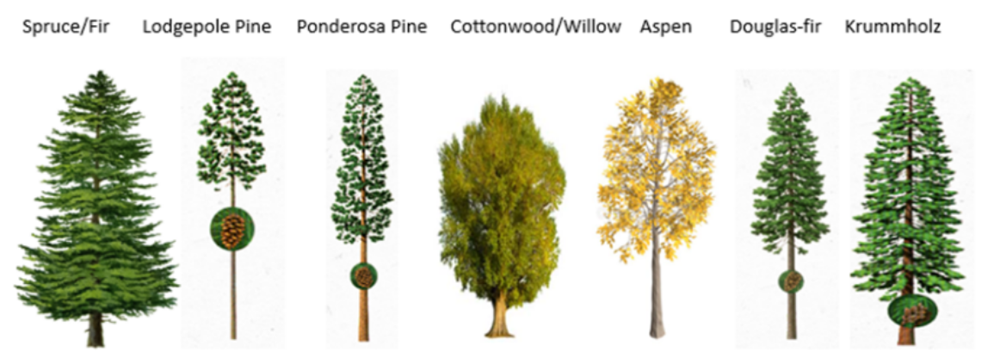

A classification program to classify cover types in Colorado´s Roosevelt National Park

# Forest Cover Type Detector - Kaggle Competition 🌲🍂

## Introduction 📚

This repository contains the code and analysis for the Kaggle competition, "Forest Cover Type Prediction." The competition focuses on solving a classification problem where the goal is to predict the predominant kind of tree cover (forest cover type) from cartographic variables, rather than remotely sensed data. The dataset includes 15120 observations in the training set, each representing a 30m x 30m patch in the Roosevelt National Forest of northern Colorado. The test set contains 565892 observations for which we need to predict the cover type.

The forest cover types to predict are as follows:
1. Spruce/Fir
2. Lodgepole Pine
3. Ponderosa Pine
4. Cottonwood/Willow
5. Aspen
6. Douglas-fir
7. Krummholz

## Data Analysis 📊

The repository contains an in-depth data analysis to understand the dataset better. It explores the data types, shape, and descriptive statistics of the features. The notebooks also explain the meaning and relevance of each variable, including wilderness area and soil type designations.

## Feature Engineering 🔧

Feature engineering is a crucial part of the data preprocessing process. The notebooks provide details about various feature engineering steps performed on the dataset. It covers outlier detection and treatment, feature transformations, and the creation of new features. Additionally, it discusses how soil types are grouped based on USFS ecological land type units and geological zones.

## Feature Selection ⛏️

To improve model performance and reduce overfitting, the repository includes feature selection techniques. It explains how different feature selection methods were employed, such as correlation analysis, filter methods, and recursive feature elimination. The selected features are used in subsequent model building.

## Model Building 🤖

The repository contains the code and evaluation of several machine learning algorithms for the forest cover type prediction task. The models used include:
- Decision Trees
- XGBoost
- Extra Tree Classifier
- Random Forest
- K-Nearest Neighbors (KNN)
- Support Vector Machine (SVM)
- Naive Bayes
- Logistic Regression
- Ensemble Methods

It provides details on how these models were implemented and their performance evaluation.

## Dimensionality Reduction 📉

In addition to feature selection, the repository explores dimensionality reduction techniques using PCA (Principal Component Analysis) and LDA (Linear Discriminant Analysis). The impact of dimensionality reduction on model performance is also discussed.

## Final Submission 🚀

It concludes with the final model used for prediction and instructions on how to make predictions on the test set. Additionally, it includes details on how to submit the predictions to the Kaggle competition.

Feel free to explore the code, analysis, and models provided in this repository. If you have any questions or suggestions, please don't hesitate to open an issue or reach out to the contributors.

## Authors 📚

Itay Young: [itayyoung](https://github.com/itayyoung)

Pedro Esteban: [callysthenes](https://github.com/Callisthenes)

Stephanie Gessler: [steguess](https://github.com/steguess)

Salma Guendy : https://github.com/salmaelguendy

Connie Kim
